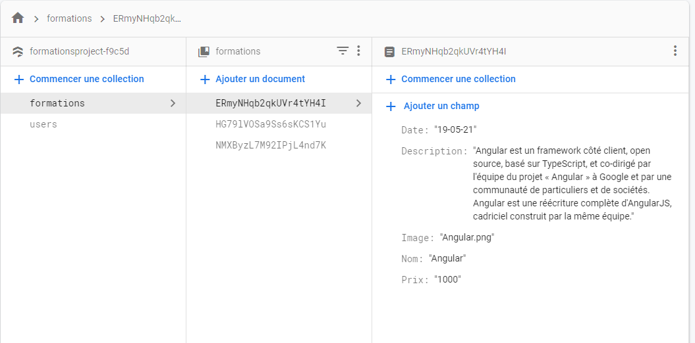
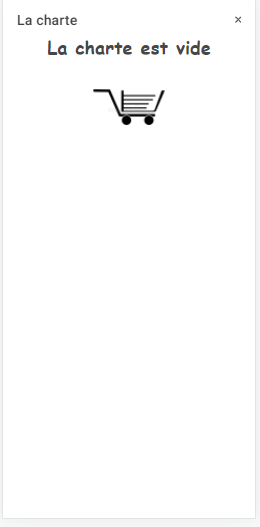

# GoTech

> GoTech est une application hybrid de gestion de l'achat des formations sur les nouvelles technologie de developpement


## Sommaire

- [GoTech](#coding)
  - [Sommaire](#Sommaire)
  - [Project Map](#project-map)
  - [Firebase](#firebase)
  - [Elements](#elements)
      - [login](#login)
      - [Sign Up](#sign-up)
      - [home](#home)
      - [charte](#charte)
      - [Details](#details)
      - [Recapitulatif](#Recapitulatif)


## Project Map

```
- src/
  - app/                      … 
    -login/                    … Contient la premiere page, c'est la page d'authentification
    -signup/                    … Contient la page qui permet de creer un nouveau compte
    -home/                    … Contient la page d'acceuil qui contient les formations et leurs prix
    -details/                    … Contient la page de details. Cette page est accessible lorsqu'on clique sur chaque formation
    -add-new-task/                    … contient la charte des formations choisi par l'utilisateur
    -recap/                    … contient la page recapitulatif aprés avoir effectuer les achats
    -models/                  … this folder contain the model of our objects (cart-item+course+user)
        - formation.ts                   … contain le model des formation (ça a été abondonné après)
    -services/
        - fireservice.service.ts              … Contient toutes les fonctions en relation avec le service firebase
+ assets/                                       Concerne les images
- environments/                               … Some settings are added, such as database settings (in our situtation firebase)
    -environment.ts                           … contient la variable qui permet de connecter ce projet avec un projet firebase
```

## Firebase
### Utilisateur

### foramtions



## Elements

---

#### login

On peut s'authentifier par email et mot de passe à l'aide du service d'authenfication de firebase, Si vous n'avez pas de compte vous pouvez cliquer sur le lien en bas pour vous diriger à la page signup


#### signup

Cette page permet de creer un compte via le service de firebase, après avoir enreistrer, on nous emmene à la page login pour s'authentifier


#### home

C'est page d'acceuil qui permet de lister les formations, l'icon en bas permet de visualiser la charte, et le bouton en haut permet de se deconnecter


#### charte

Cette page est accessible via la page home spécifiquement via le boutton vert en bas, elle permet de lister les formations mis dans la charte par l'utilisateur




#### Details

Cette page contient tous les details de la formation, elle accessible en cliquant sur chaque formation dans la page d'acceuil


#### Recapitulatif

Cette page est accessible via la page de la charte, elle permet de terminer le processus d'achat et vider la charte


## Version

les versions des technologies dans ce projet

| Technologie Name | Version |
| :--------------- | :-----: |
| ionic            | 6.18.2  |
| angular          | 13.2.6  |
| npm              | 16.13.2 |
| firebase         | 10.4.2  |
